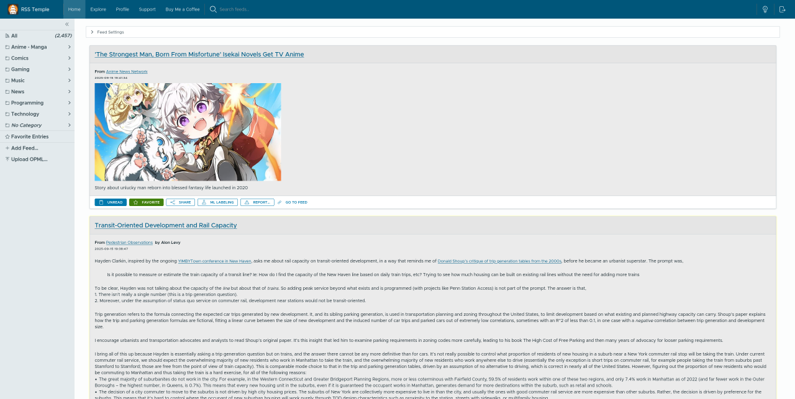
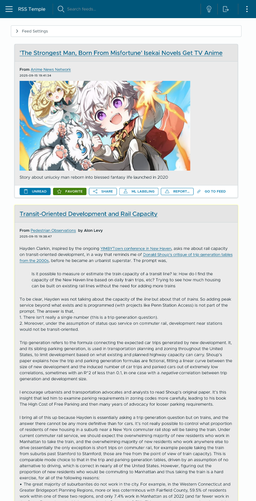

  
   
  <h2 style="font-size: 32px;">
    RSS Temple
  </h2>

  <h3 style="font-size: 25px;">
    A fast, powerful, self-hostable RSS reader.
  </h3>
   

[![license-badge-img]][license-badge]
[![release-badge-img]][release-badge]
[![Docker][docker-pulls-badge-img]][docker-pulls-badge]
[![CircleCI][circleci-badge-img]][circleci-badge]
[![codecov][codecov-badge-img]][codecov-badge]

  

# Table of Contents

- [Table of Contents](#table-of-contents)
- [Overview](#overview)
  - [Features](#features)
  - [Preview](#preview)
- [Installation](#installation)
- [Technical Support](#technical-support)
- [Project Support](#project-support)

# Overview

RSS Temple is a fast, powerful, and self-hostable RSS/Atom reader, with a light, clean UI, and powerful subscription and search features.

## Features

- Subscribe to any RSS or Atom feed
- Can't find the feed URL? No problem, RSS Temple will find it for you
- Fast, full-text search
- Keyboard shortcuts

## Preview

|                                       🖥 Desktop                                       |                                                           📱 Mobile                                                            |
| :------------------------------------------------------------------------------------: | :----------------------------------------------------------------------------------------------------------------------------: |
|  |  |

# Installation

// TODO

# Technical Support

If you have any issues with RSS Temple, please [open an issue](https://github.com/murrple-1/rss_temple/issues/new) in this repository.

# Project Support

Consider supporting the development of this project on Ko-Fi. All funds will be used to cover the costs of hosting, development, and maintenance of RSS Temple.

[circleci-badge-img]: https://img.shields.io/circleci/build/github/murrple-1/rss_temple?style=for-the-badge
[circleci-badge]: https://dl.circleci.com/status-badge/redirect/gh/murrple-1/rss_temple/tree/master
[codecov-badge-img]: https://img.shields.io/codecov/c/github/murrple-1/rss_temple?style=for-the-badge
[codecov-badge]: https://codecov.io/gh/murrple-1/rss_temple

[license-badge-img]: https://img.shields.io/github/license/murrple-1/rss_temple?style=for-the-badge&color=a32d2a
[license-badge]: LICENSE
[release-badge-img]: https://img.shields.io/github/v/release/murrple-1/rss_temple?style=for-the-badge
[release-badge]: https://github.com/murrple-1/rss_temple/releases
[docker-pulls-badge-img]: https://img.shields.io/docker/pulls/murraychristopherson/rss_temple?style=for-the-badge&label=pulls
[docker-pulls-badge]: https://hub.docker.com/r/murraychristopherson/rss_temple
