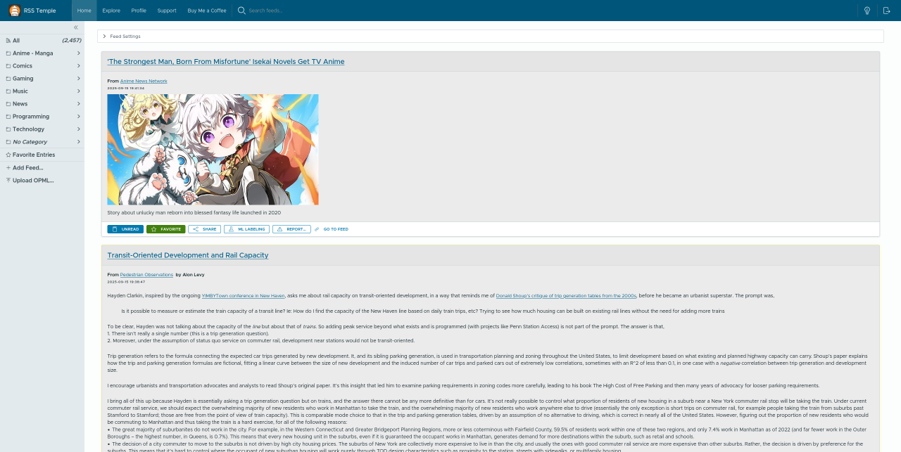
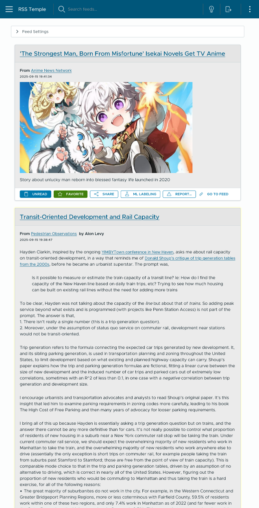
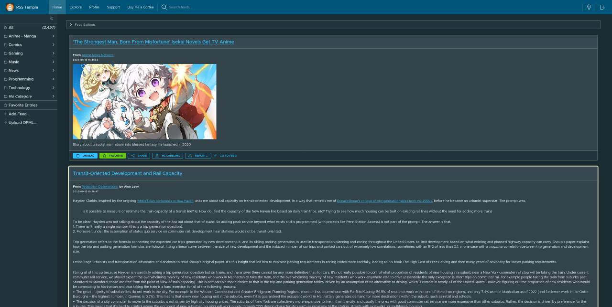
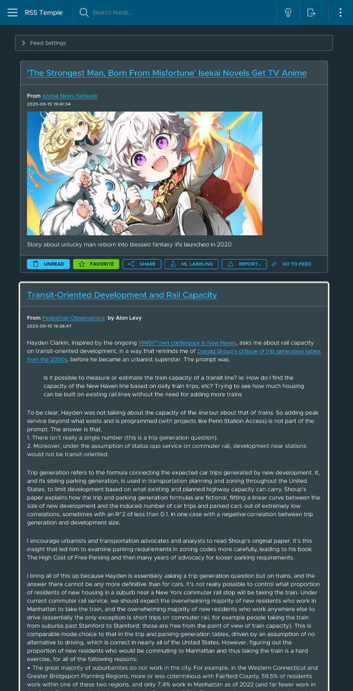

<div align="center">
  
  <br />
  <h2 style="font-size: 32px;">
    RSS Temple
  </h2>

  <h3 style="font-size: 25px;">
    A fast, powerful, self-hostable RSS reader.
  </h3>
  <br/>

[![license-badge-img]][license-badge]
[![release-badge-img]][release-badge]
[![Docker][docker-pulls-badge-img]][docker-pulls-badge]
[![CircleCI][circleci-badge-img]][circleci-badge]
[![codecov][codecov-badge-img]][codecov-badge]

  </div>
</div>

# Table of Contents

- [Table of Contents](#table-of-contents)
- [Overview](#overview)
  - [Features](#features)
  - [Preview](#preview)
- [Installation](#installation)
- [Technical Support](#technical-support)
- [Project Support](#project-support)

# Overview

RSS Temple is a fast, powerful, and self-hostable RSS/Atom reader, with a light, clean UI, and powerful subscription and search features.

It was original written as a personal attempt to reproduce the feeling of [Google Reader](https://en.wikipedia.org/wiki/Google_Reader), but with some of the features that I liked from [Feedly](https://feedly.com), without needing to pay the subscription cost.

The official deployment of this project is at [rsstemple.com](https://rsstemple.com), but I have no issue with this project being forked or redeployed.

My hope is that one day, this project be fully home-lab ready - so please, open a PR to help make this a reality.

---

It is made up of 3 projects - a landing page, an app frontend, and an app backend.

* The landing page code can be found [here](https://github.com/murrple-1/rss_temple_ui/tree/master/rss-temple-home).
* The app frontend code can be found [here](https://github.com/murrple-1/rss_temple_ui/tree/master/rss-temple-web-app).
* The backend code can be found [here](https://github.com/murrple-1/rss_temple).

Additionally, there is an Ansible collection (code available [here](https://github.com/murrple-1/ansible-collection-rss-temple), Ansible Galaxy deployment [here](https://galaxy.ansible.com/ui/repo/published/murrple_1/rss_temple/)) and a Terraform project (available [here](https://github.com/murrple-1/terraform-rss-temple)) which are intended to make deployment as easy as possible.

## Features

- Subscribe to any RSS or Atom feed
- Can't find the feed URL? No problem, RSS Temple will find it for you
- Fast, full-text search
- Keyboard shortcuts

## Preview

|                                       🖥 Desktop                                       |                                                           📱 Mobile                                                            |
| :------------------------------------------------------------------------------------: | :----------------------------------------------------------------------------------------------------------------------------: |
|  |  |
|  |  |

# Installation

## Ansible (recommended)

Assuming you want to install everything on your current (local) machine:

```bash
# install the Ansible collection
ansible-galaxy collection install murrple_1.rss_temple
# sets up the shared infrastructure for the 3 projects
ansible-playbook --connection=local --inventory localhost, murrple_1.rss_temple.pre_rss_temple
# deploy the app backend
ansible-playbook --connection=local --inventory localhost, murrple_1.rss_temple.rss_temple
# deploy the app frontend
ansible-playbook --connection=local --inventory localhost, murrple_1.rss_temple.rss_temple_web_app
# deploy the landing page
ansible-playbook --connection=local --inventory localhost, murrple_1.rss_temple.rss_temple_home
```

## Manual

### RSS Temple Infrastructure

Ensure [Docker](https://docs.docker.com/engine/install/) is installed.

```bash
# create the shared Docker network
docker network create global_rss_temple_net
```

Create a directory `/opt/rss_temple/rss_temple_infra/`.

In the new directory, create the following files - editing them as needed:

`/opt/rss_temple/rss_temple_infra/docker-compose.yml`
```yaml
services:
  caddy:
    image: caddy:2-alpine
    restart: always
    ports:
      - '80:80'
      - '443:443'
    volumes:
      - caddy_data:/data/
      - ./Caddyfile:/etc/caddy/Caddyfile
    networks:
      - default
      - global_rss_temple_net
volumes:
  caddy_data:
networks:
  global_rss_temple_net:
    external: true
```

`/opt/rss_temple/rss_temple_infra/Caddyfile`
```
https://api.rsstemple.com {
  log

  encode gzip

  reverse_proxy caddy-rss_temple:8000
}

http://api.rsstemple.com {
  respond "The API is only accessible over HTTPS" 403 {
    close
  }
}

app.rsstemple.com {
  log

  encode gzip

  reverse_proxy caddy-rss_temple_web_app:4200
}

rsstemple.com {
  log

  encode gzip

  reverse_proxy caddy-rss_temple_home:3000
}
```

Replace `rsstemple.com` with your top-level domain.

Start the containers with `docker compose up -d`.

### RSS Temple Backend

Create a directory `/opt/rss_temple/rss_temple/`, and also `/opt/rss_temple/rss_temple/overrides/` and `/opt/rss_temple/rss_temple/mount/`.

Create the following files - editing them as needed:

`/opt/rss_temple/rss_temple/docker-compose.yml`
```yaml
x-rss-temple-image: &rss-temple-image
  image: 'murraychristopherson/rss_temple:latest'

services:
  valkey:
    image: valkey/valkey:8-alpine
    command: valkey-server /usr/local/etc/valkey/valkey.conf
    restart: always
    volumes:
      - ./overrides/valkey.conf:/usr/local/etc/valkey/valkey.conf
    networks:
      - rss_temple_net
  postgresql:
    image: postgres:18-alpine
    restart: always
    shm_size: '256m'
    expose:
      - '5432'
    env_file:
      - .env
    volumes:
      - db_data:/var/lib/postgresql/data/
    networks:
      - rss_temple_net
  caddy-rss_temple:
    image: caddy:2-alpine
    restart: always
    expose:
      - '8000'
    volumes:
      - ./Caddyfile:/etc/caddy/Caddyfile
      - caddy_data:/data/
      - django_static:/srv/
    networks:
      - rss_temple_net
      - global_rss_temple_net
  rss_temple:
    <<: *rss-temple-image
    command: >
      sh -c "
        while ! python ./manage.py checkready; do
          sleep 0.1
        done

        python ./manage.py collectstatic --noinput &

        python ./manage.py migrate

        exec gunicorn \\
          -b 0.0.0.0:8000 \\
          rss_temple.wsgi:application
      "
    restart: always
    environment:
      APP_IN_DOCKER: 'true'
      MALLOC_CONF: background_thread:true,max_background_threads:1,metadata_thp:auto,dirty_decay_ms:30000,muzzy_decay_ms:30000
      #APP_DEBUG: 'true'
      #APP_DJANGO_DB_BACKEND_LOG_LEVEL: DEBUG
    env_file:
      - .env
    volumes:
      - ./overrides/local_settings.py:/code/rss_temple/local_settings.py
      - ./overrides/gunicorn.conf.py:/code/gunicorn.conf.py
      - ./mount/:/code/mount/
      - django_static:/code/_static/
    networks:
      - default  # necessary, because functionality requires making calls to the external internet
      - rss_temple_net
  rss_temple_dramatiq:
    <<: *rss-temple-image
    command: dramatiq api_dramatiq.main -Q rss_temple
    restart: always
    environment:
      APP_IN_DOCKER: 'true'
      MALLOC_CONF: background_thread:true,max_background_threads:1,metadata_thp:auto,dirty_decay_ms:30000,muzzy_decay_ms:30000
    env_file:
      - .env
    volumes:
      - ./overrides/local_settings.py:/code/rss_temple/local_settings.py
      - ./mount/:/code/mount/
    networks:
      - default  # necessary, because functionality requires making calls to the external internet
      - rss_temple_net
  rss_temple_schedulerdaemon:
    <<: *rss-temple-image
    command: >
      sh -c "
        while ! python ./manage.py checkready; do
          sleep 0.1
        done

        while ! python ./manage.py migrate --check; do
          sleep 5
        done

        python ./manage.py checkclassifierlabels

        exec python ./manage.py schedulerdaemon /schedulerdaemon.json
      "
    restart: always
    environment:
      APP_IN_DOCKER: 'true'
      MALLOC_CONF: background_thread:true,max_background_threads:1,metadata_thp:auto,dirty_decay_ms:30000,muzzy_decay_ms:30000
    env_file:
      - .env
    volumes:
      - ./schedulerdaemon.json:/schedulerdaemon.json
      - ./overrides/local_settings.py:/code/rss_temple/local_settings.py
      - ./mount/:/code/mount/
    networks:
      - rss_temple_net
volumes:
  db_data:
  caddy_data:
  django_static:
networks:
  global_rss_temple_net:
    external: true
  rss_temple_net:
    internal: true
```

`/opt/rss_temple/rss_temple/.env`
```sh
TZ=UTC
DJANGO_SETTINGS_MODULE=rss_temple.settings

POSTGRES_PASSWORD='CHANGE_ME_POSTGRES_PASSWORD'

APP_DEBUG=False

APP_DB_HOST=postgresql
APP_DB_USER=postgres
APP_DB_PASSWORD='CHANGE_ME_POSTGRES_PASSWORD'

APP_REDIS_URL=redis://valkey:6379

APP_SECRET_KEY='CHANGE_ME_SECRET_KEY'

APP_SESSION_COOKIE_DOMAIN=.rsstemple.com
APP_CSRF_TRUSTED_ORIGINS=https://api.rsstemple.com,https://app.rsstemple.com
APP_CSRF_COOKIE_DOMAIN=.rsstemple.com

APP_EMAIL_HOST=
APP_EMAIL_PORT=587
APP_EMAIL_HOST_USER=
APP_EMAIL_HOST_PASSWORD=
APP_EMAIL_USE_TLS=True
APP_EMAIL_USE_SSL=False
APP_EMAIL_TIMEOUT=10.0
APP_DEFAULT_FROM_EMAIL=

APP_ACCOUNT_CONFIRM_EMAIL_URL='https://app.rsstemple.com/verify?token=%(key)s'
APP_ACCOUNT_EMAIL_VERIFICATION_SENT_URL=https://app.rsstemple.com/emailsent
APP_PASSWORD_RESET_CONFIRM_URL_FORMAT='https://app.rsstemple.com/resetpassword?token=%(token)s&userId=%(userId)s'
APP_SOCIAL_CONNECTIONS_URL=https://app.rsstemple.com/main/profile
APP_SOCIAL_SIGNUP_URL=https://app.rsstemple.com/register
```

Replace `rsstemple.com` with your top-level domain.

Generate, or otherwise replace, the passwords/secret keys (values start with `'CHANGE_ME_'`) with secure alternatives.

> *TODO*: I should integrate some secret management.

You'll want to setup the `APP_EMAIL_*` variables, to setup email verification.

`/opt/rss_temple/rss_temple/schedulerdaemon.json`
```json
{
    "archive_feed_entries": {},
    "delete_old_job_executions": {},
    "extract_top_images": {},
    "feed_scrape": {},
    "flag_duplicate_feeds": {},
    "label_feeds": {},
    "label_users": {},
    "purge_duplicate_feed_urls": {},
    "purge_expired_data": {},
    "setup_subscriptions": {},
    "ignore_missed_top_images": {}
}
```

`/opt/rss_temple/rss_temple/Caddyfile`
```
:8000 {
        encode gzip

        @nocache {
                path *.manifest *.appcache *.html *.xml *.json
        }
        header @nocache {
                ?Cache-Control "no-cache"
        }

        @yearcache {
                path *.css *.js
        }
        header @yearcache {
                ?Cache-Control "max-age=31536000"
        }

        handle_path /static* {
                root * /srv
                file_server
        }

        @web {
                path *
        }
        reverse_proxy @web rss_temple:8000
}
```

`/opt/rss_temple/rss_temple/overrides/local_settings.py`
```python
import warnings

from html5lib.constants import DataLossWarning

warnings.simplefilter("ignore", category=DataLossWarning)
```

`/opt/rss_temple/rss_temple/overrides/gunicorn.conf.py`
```python
worker_class = "gthread"
capture_output = True
accesslog = "-"
```

`/opt/rss_temple/rss_temple/overrides/valkey.conf`
```
maxmemory 0
maxmemory-policy noeviction
```

Start the containers with `docker compose up -d`.

### RSS Temple Frontend

Create a directory `/opt/rss_temple/rss_temple_web_app/`, and also `/opt/rss_temple/rss_temple_web_app/custom_html/`.

In the new directory, create the following files - editing them as needed:

`/opt/rss_temple/rss_temple_web_app/docker-compose.yml`
```yaml
x-rss-temple-web-app-image: &rss-temple-web-app-image
  image: 'murraychristopherson/rss_temple_web_app:latest'

services:
  caddy-rss_temple_web_app:
    <<: *rss-temple-web-app-image
    command: >
      ash -c "
        if [ -e /custom_html/index.head.html ]; then
          echo 'customizing /srv/index.html...'
          sed -i -e \"/<!-- DEPLOYMENT HEAD START -->/,/<!-- DEPLOYMENT HEAD END -->/{/<!-- DEPLOYMENT HEAD START -->/{r /custom_html/index.head.html
      p};/<!-- DEPLOYMENT HEAD END -->/!d}\" /srv/index.html
          echo 'done'
        fi
        exec caddy run --config /etc/caddy/Caddyfile --adapter caddyfile
      "
    restart: always
    expose:
      - '4200'
    volumes:
      - caddy_data:/data/
      - caddy_config:/config/
      - ./Caddyfile:/etc/caddy/Caddyfile
      - ./config.json:/srv/assets/config.json
      - ./custom_html/:/custom_html/
    networks:
      - rss_temple_web_app_net
      - global_rss_temple_net
volumes:
  caddy_data:
  caddy_config:
networks:
  global_rss_temple_net:
    external: true
  rss_temple_web_app_net:
    internal: true
```

`/opt/rss_temple/rss_temple_web_app/Caddyfile`
```
:4200 {
  header {
    X-Content-Type-Options "nosniff"
    X-Frame-Options "DENY"
    Content-Security-Policy "default-src 'none'; script-src 'self' apis.google.com connect.facebook.net; connect-src 'self' *.rsstemple.com www.facebook.com; img-src * data: blob:; style-src 'self' 'unsafe-inline'; base-uri 'self'; form-action 'self'; font-src 'self' data:; frame-src *; media-src blob:"
    X-XSS-Protection "1"
    Strict-Transport-Security "max-age=31536000; includeSubDomains"
  }

  root * /srv/
  file_server
  try_files {path} /index.html
}
```

`/opt/rss_temple/rss_temple_web_app/config.json`
```json
{
  "apiHost": "https://api.rsstemple.com",
  "clientRepoUrl": "https://github.com/murrple-1/rss_temple_ui",
  "facebookAppId": "CHANGE_ME_FACEBOOK_APP_ID",
  "googleClientId": "CHANGE_ME_GOOGLE_CLIENT_ID",
  "issueTrackerUrl": "https://github.com/murrple-1/rss_temple/issues",
  "onboardingYoutubeEmbededUrl": "https://www.youtube.com/embed/dQw4w9WgXcQ",
  "serverRepoUrl": "https://github.com/murrple-1/rss_temple",
  "privacyPolicyUrl": "https://rsstemple.com/privacy",
  "tosUrl": "https://rsstemple.com/tos",
  "forceLabelThreshold": 0.5,
  "extraNavLinks": [],
  "donationBadges": [],
  "lemmyInstanceSuggestions": [
    "lemmy.world",
    "lemmy.ml",
    "lemm.ee",
    "lemmy.zip"
  ],
  "mastodonInstanceSuggestions": ["mastodon.social", "mastodon.online"]
}
```

Replace `rsstemple.com` with your top-level domain.

Replace the app IDs (values start with `'CHANGE_ME_'`) with your own IDs (this allows for SSO login).

`/opt/rss_temple/rss_temple_web_app/custom_html/index.head.html`
```html
<meta property="og:title" content="RSS Temple App" />
<meta property="og:image" content="https://app.rsstemple.com/assets/images/og_image.jpg" />
<meta property="og:url" content="https://app.rsstemple.com" />
<meta property="og:type" content="website" />
<meta property="og:description" content="The Zen of Syndication" />
```

Replace `rsstemple.com` with your top-level domain.

Start the containers with `docker compose up -d`.

### RSS Temple Landing Page

*TODO write this*

# Technical Support

If you have any issues with RSS Temple, please [open an issue](https://github.com/murrple-1/rss_temple/issues/new) in this repository.

# Project Support

Consider supporting the development of this project on Ko-Fi. All funds will be used to cover the costs of hosting, development, and maintenance of RSS Temple.

<a href="https://ko-fi.com/murraychristopherson">
  
</a>

[license-badge-img]: https://img.shields.io/github/license/murrple-1/rss_temple?style=for-the-badge&color=a32d2a
[license-badge]: LICENSE
[release-badge-img]: https://img.shields.io/github/v/release/murrple-1/rss_temple?style=for-the-badge
[release-badge]: https://github.com/murrple-1/rss_temple/releases
[docker-pulls-badge-img]: https://img.shields.io/docker/pulls/murraychristopherson/rss_temple?style=for-the-badge&label=pulls
[docker-pulls-badge]: https://hub.docker.com/r/murraychristopherson/rss_temple
[circleci-badge-img]: https://img.shields.io/circleci/build/github/murrple-1/rss_temple?style=for-the-badge
[circleci-badge]: https://dl.circleci.com/status-badge/redirect/gh/murrple-1/rss_temple/tree/master
[codecov-badge-img]: https://img.shields.io/codecov/c/github/murrple-1/rss_temple?style=for-the-badge
[codecov-badge]: https://codecov.io/gh/murrple-1/rss_temple
